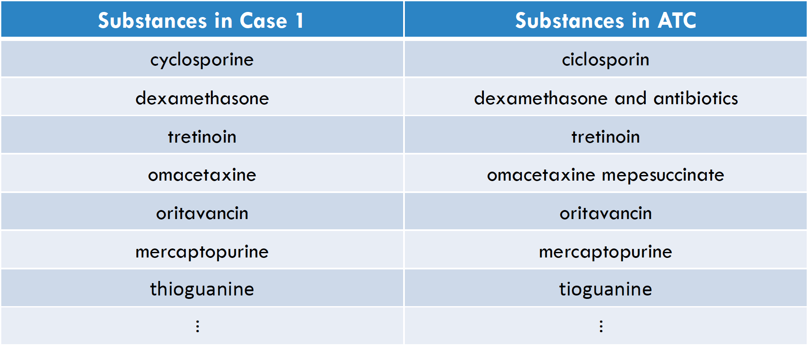
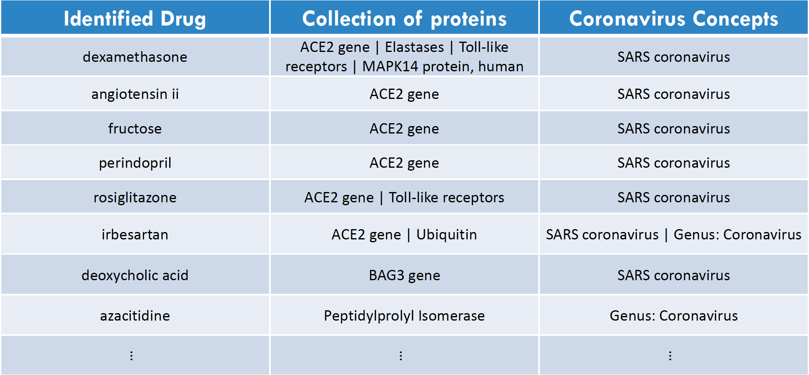

# Data analysis on relationships between pharmacologic substances or targets & disease

### Description of data

The analysis is dependant to two datasets that contain valuable information about the relationship of several chemicals & drugs with coronavirus.

- In the 1st dataset these relations are directly reported.

- In the 2nd dataset the pharmacologic substances show their effectiveness on coronavirus through genes, proteins or receptors.

- Also, we have available data from ATC, a system that classifies active ingredients of drugs according to the organ or system on which they act.

### Description of the analysis

The analysis is divided in 2 cases regarding to which dataset will be used. 

**1. Based on the 1st dataset:**

• First distinguish drugs from chemicals based on ATC’s list of drugs.

• Second find the Top 10 Key Opinion Leaders for every drug identified in our data.

**2. Based on the 2nd dataset:**

• First identify the drugs as before and for each drug to report the corresponding collection of proteins and coronavirus concepts.

• Then show which substances have similar targets.

# Installation & run project
These are the packages used in the analysis:
```R
library(stringdist)
library(tidyverse)
library(stringi)
library(readxl)
library(writexl)
library(quanteda)
library(igraph)
library(ggraph)
```

```bash
git clone https://github.com/askandali/coronavirus-analysis.git
cd coronavirus-analysis

install.packages("stringdist","tidyverse","stringi","readxl","writexl","quanteda","igraph","ggraph")
Rscript coronavirus_analysis.R
```

## Drug Identification

In order to identify which substances of our list are included also in ATC ontology, we created a mechanism that checks for all of our substances :

- If the ATC list has a drug with the same name or part of it (e.g. zinc ~ zinc products).
- Or if there is a drug with similar name (e.g. cyclosporine ~ ciclosporin). This was implemented by calculating pairwise string similarity scores.

### Identified drugs in the 1st case & text visualization based on the frequence a drug is detected



>The full list of identified dugs is in the output folder with name “IIdentified_Drugs_case_1.xlsx” file.


>The word cloud consists of all the substances that were identified in ATC and the size corresponds to the frequency of this substance in our dataset.


## Top 10 Key Opinion Leaders per Drug

> A **key opinion leader** (KOL) is generally an experienced physician trusted to give candid feedback to **pharmaceutical** suppliers. They are also knowledgeable about industry news, clinical trials, and other developments relevant to their specialties.


>The full list of key opinion leaders per drug is in the output folder with name “Top10_KOL.xlsx” file.

## Proteins & Coronavirus concepts per drug

The identification of the drugs from ATC list was completed for the case 2 dataset, by following the same identification technique.

>The full list of identified dugs is in the output folder with name “IIdentified_Drugs_case_2.xlsx” file.

As part of the analysis, a classification over proteins and coronavirus concepts was implemented:


 
>The full list of identified dugs is in the output folder with name “Proteins & Consepts_per_Substance.xlsx” file.

## Clustering based on protein target


## Additional information

- The identification algorithm in some cases found a drug with several names in ATC. For example, “vaccines” was found in “Meningococcal vaccines”, “Rubella vaccines” and more.

- The Key Opinion Leaders (KOL) were found by extracting all the scientists/authors related to the specific drug. Then, by calculating how many times someone has been referred to this particular drug, we were able to report the Top 10 KOL.

- Some drugs have less than 10 KOL, because less than 10 scientists/authors have been referred to them. For instance “riboflavin” has only Bowen Richard, Marschner Susanne & Keil Shawn D.